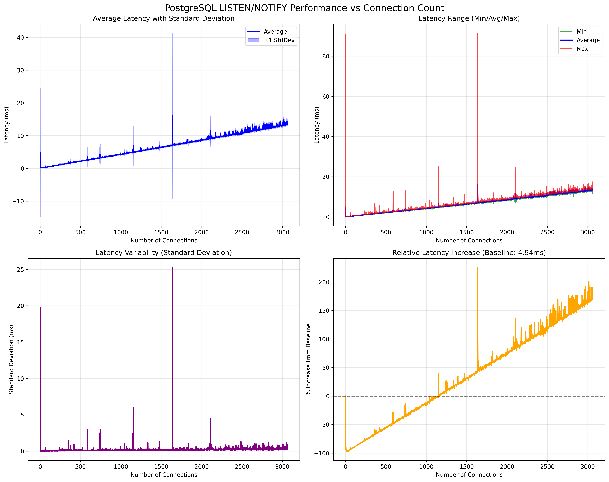

# pg-bench-listen-notify

A Rust benchmarking tool to measure PostgreSQL LISTEN/NOTIFY performance degradation as the number of idle listening connections increases.

## Overview

This tool demonstrates how PostgreSQL's LISTEN/NOTIFY round-trip time is affected by the number of concurrent connections, even when those connections are idle. It creates a controlled environment to measure this effect by:

- Setting up a temporary PostgreSQL instance
- Creating two threads that exchange LISTEN/NOTIFY messages in a ping-pong pattern
- Progressively adding idle listening connections (up to 10,000)
- Measuring round-trip latency at each stage
- Then removing connections one by one to observe recovery

## Results



The benchmark typically shows that LISTEN/NOTIFY latency increases proportionally with the number of listening connections, even when those connections are completely idle.

## Requirements

- PostgreSQL command-line tools (`initdb`, `pg_ctl`, `createdb`) in PATH
- Rust 1.70 or later
- Python 3.7+ (for plotting results)
- macOS or Linux (Windows not currently supported)
- At least 32GB RAM recommended for full 10,000 connection test

## Installation

```bash
# Clone the repository
git clone https://github.com/joelonsql/pg-bench-listen-notify
cd pg-bench-listen-notify

# Build the project
cargo build --release
```

## Usage

### Running the Benchmark

```bash
# Run with default settings (up to 10,000 connections)
cargo run --release

# The tool will:
# 1. Create a temporary PostgreSQL instance
# 2. Configure it for high connection count
# 3. Run the benchmark
# 4. Save results to stats.csv
# 5. Clean up the temporary instance
```

### Plotting Results

```bash
# Install Python dependencies and generate plot
./plot.sh

# Or manually:
pip install -r requirements.txt
python plot_stats.py

# Custom input/output files
python plot_stats.py custom_stats.csv custom_plot.png
```

## How It Works

### Benchmark Process

1. **Setup Phase**
   - Creates a temporary PostgreSQL instance with `max_connections=10100`
   - Configures shared_buffers and other settings for high connection count
   - Increases OS file descriptor limits

2. **Measurement Phase**
   - Two threads (`thread_1` and `thread_2`) exchange LISTEN/NOTIFY messages
   - Each notification round-trip time is measured
   - After every 20 measurements (10 per thread), statistics are calculated
   - A new idle listening connection is added
   - Process continues until 10,000 idle connections

3. **Decreasing Phase**
   - After reaching 10,000 connections, removes one connection after each measurement
   - Continues until back to just the two active threads
   - Allows observation of whether latency recovers

### What Gets Measured

- **Round-trip time**: Time from sending NOTIFY to receiving the notification
- **Statistics per connection count**:
  - Minimum latency
  - Average latency
  - Maximum latency
  - Standard deviation

## Output Files

- `stats.csv` - Raw benchmark data with columns:
  - `connections`: Total number of connections
  - `min_ms`: Minimum latency in milliseconds
  - `avg_ms`: Average latency in milliseconds
  - `max_ms`: Maximum latency in milliseconds
  - `stddev_ms`: Standard deviation in milliseconds

- `benchmark_results.png` - Visualization showing:
  - Average latency with standard deviation
  - Min/Max/Average comparison
  - Latency variability over time
  - Percentage increase from baseline

## Technical Details

### PostgreSQL Configuration

The tool automatically configures PostgreSQL with:
- `max_connections = 10100`
- `shared_buffers = 32GB` (for 128GB RAM systems)
- `work_mem = 1MB`
- `maintenance_work_mem = 256MB`

### OS Limits

On macOS, the tool attempts to increase file descriptor limits. If you encounter "Too many open files" errors, run:

```bash
sudo launchctl limit maxfiles 65536 200000
ulimit -n 20000
```

### Implementation Details

- Uses `tokio-postgres` for async PostgreSQL connections
- Each connection runs in a separate Tokio task
- Notifications are processed using PostgreSQL's async message system
- Timing uses high-resolution `Instant::now()` measurements

## Interpreting Results

A typical benchmark shows:
- **Linear increase**: Latency often increases linearly with connection count
- **Baseline**: With just 2-3 connections, latency is typically < 1ms
- **At scale**: With 10,000 connections, latency can increase 10-100x
- **Recovery**: When connections are removed, latency typically recovers

This demonstrates why connection pooling is important for applications using LISTEN/NOTIFY.

## Troubleshooting

### "Too many open files" Error
Increase your system's file descriptor limit (see OS Limits section).

### "max_connections" Not Taking Effect
The tool uses `ALTER SYSTEM` and restarts PostgreSQL. Check PostgreSQL logs in the temporary directory if issues persist.

### Connection Failures
Ensure PostgreSQL tools are in your PATH and you have sufficient system resources.

## Contributing

Contributions are welcome! Please feel free to submit issues or pull requests.

## License

MIT License - See LICENSE file for details