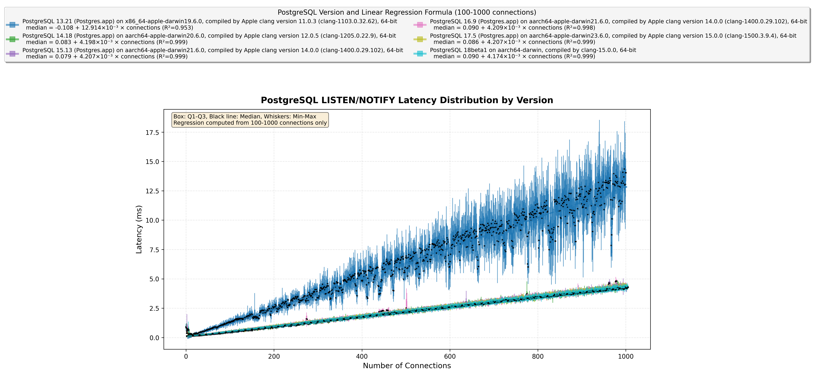
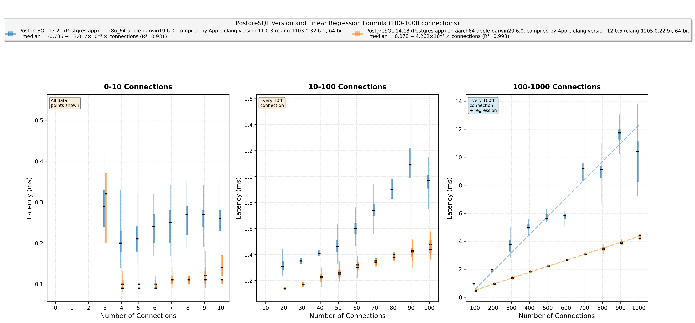
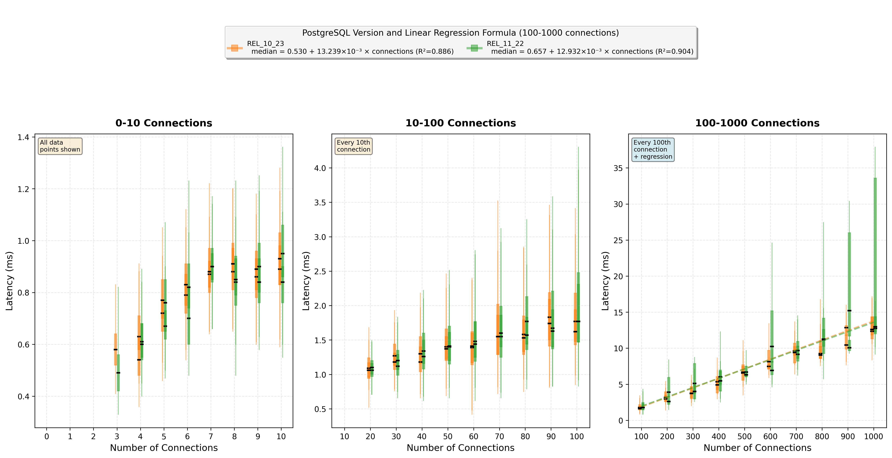
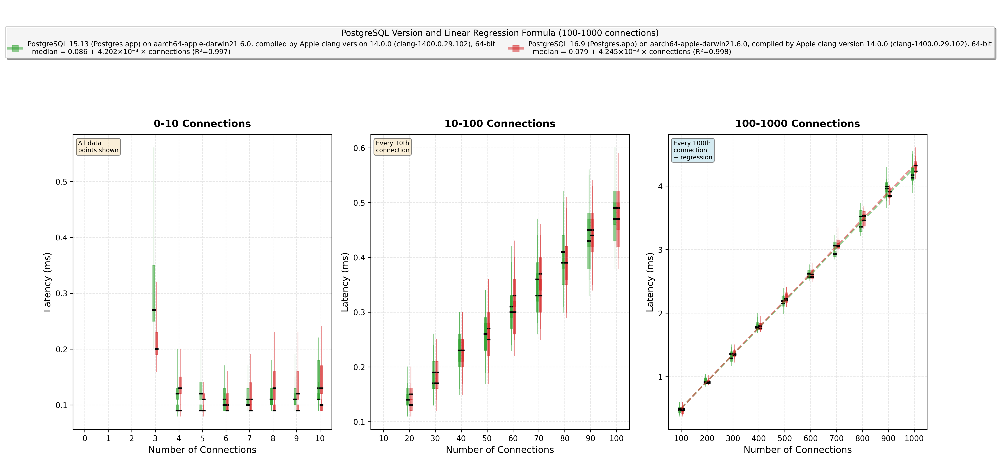
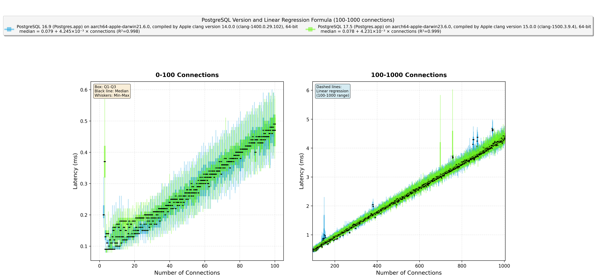
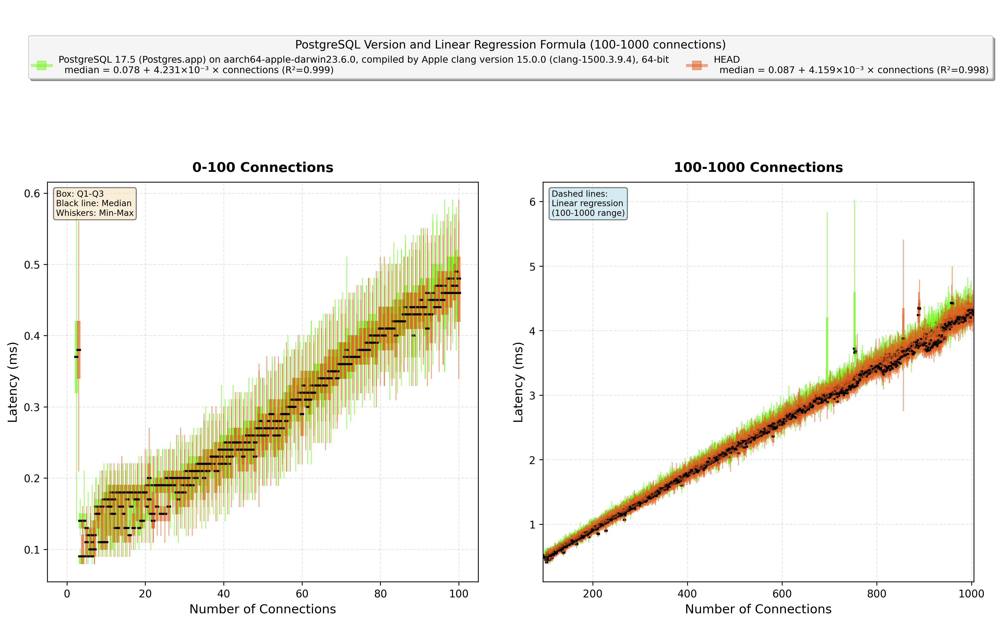
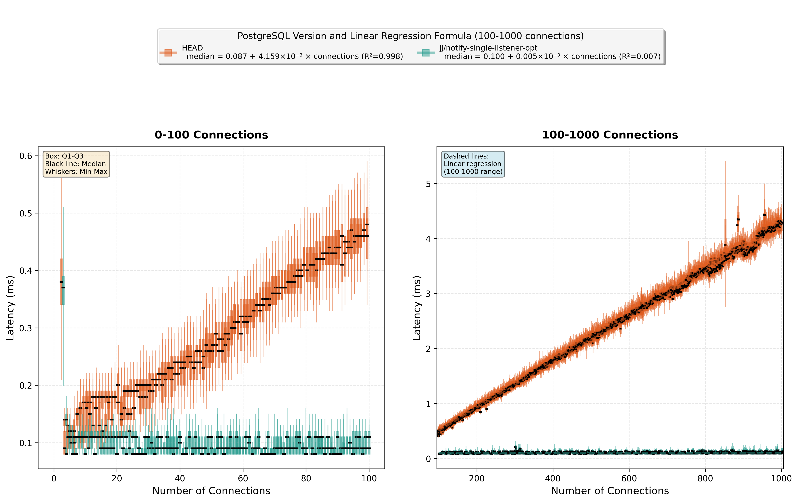

# pg-bench-listen-notify

A benchmarking tool that measures how PostgreSQL LISTEN/NOTIFY performance scales with the number of idle listening connections.

## Key Results

### Overall Comparison


### Scaling Analysis: O(N) vs O(1) Behavior

Our analysis reveals that PostgreSQL LISTEN/NOTIFY exhibits **O(N) scaling** for all standard versions, where N is the number of listening connections. Only the optimization patch achieves true **O(1) constant-time** performance.

| Version | Complexity | Latency Formula (N ≥ 100) |
|---------|------------|----------------------------|
| PostgreSQL 13.21 | O(N) | -0.034 + 12.419×10⁻³ × N ms |
| PostgreSQL 14-17 | O(N) | ~0.08 + 4.2×10⁻³ × N ms |
| HEAD | O(N) | 0.087 + 4.159×10⁻³ × N ms |
| [jj/notify-single-listener-opt](https://github.com/joelonsql/postgresql/commit/4adfad94cd22b17fb3809d46b0d5a04a64be4884) | **O(1)** | **≈ 0.102 ms (constant)** |

### Understanding LISTEN/NOTIFY Latency

**Base latency (2-3 connections):** PostgreSQL's LISTEN/NOTIFY achieves remarkably low round-trip latencies of **0.08-0.10 ms** when only the essential connections are present. This sub-millisecond performance makes it an attractive choice for real-time applications.

**Impact of idle connections:** For standard PostgreSQL versions with O(N) scaling:
- **PostgreSQL 14-HEAD**: Each connection adds ~4.2 µs to every notification
- **PostgreSQL 13**: Each connection adds ~12.4 µs (3x worse)
- **Optimization patch**: Latency remains constant at ~0.1 ms regardless of connections

This means with 1,000 connections, a notification that originally took 0.08ms will take:
- **4.3ms** on PostgreSQL 14+ (50x slower)
- **12.4ms** on PostgreSQL 13 (155x slower)
- **0.1ms** with the optimization patch (no degradation)

### PostgreSQL 14's LISTEN/NOTIFY Performance Breakthrough

PostgreSQL 13 exhibits significantly noisier measurements (R²=0.953) compared to newer versions (R²=0.998-0.999), suggesting less predictable performance. PostgreSQL 14 introduced critical optimizations that reduced per-connection overhead by 67%.

The key improvement likely came from **eliminating synchronous fsync calls** in the notification queue ([commit dee663f](https://github.com/postgres/postgres/commit/dee663f7843)). Previously, PostgreSQL would fsync after writing each notification queue page, causing I/O stalls that scaled poorly with many connections. PostgreSQL 14 defers these writes to the next checkpoint, dramatically reducing overhead.

Additional optimizations include:
- **Streamlined signal handling** ([commit 0eff10a](https://github.com/postgres/postgres/commit/0eff10a0084)) - moved NOTIFY signals to transaction commit, eliminating redundant operations
- **Fixed race conditions** ([commit 9c83b54](https://github.com/postgres/postgres/commit/9c83b54a9cc)) - prevented queue truncation issues under concurrent load
- **Prevented SLRU lock contention** ([commit 566372b](https://github.com/postgres/postgres/commit/566372b3d64)) - avoided concurrent SimpleLruTruncate operations

These improvements have been maintained through versions 15, 16, 17, and HEAD.

### Version-by-Version Performance Evolution

#### PostgreSQL 13 → 14: The Major Performance Breakthrough


The most dramatic improvement in LISTEN/NOTIFY history: 67% reduction in per-connection overhead.

#### PostgreSQL 14 → 15: Stable Performance


Performance characteristics remain consistent with minor improvements.

#### PostgreSQL 15 → 16: Continued Stability


The O(N) scaling pattern continues with ~4.2 µs per connection.

#### PostgreSQL 16 → 17: Maintained Efficiency


No regression in performance; the improvements from v14 are preserved.

#### PostgreSQL 17 → HEAD: Current Development


HEAD maintains the same O(N) scaling as stable versions.

#### HEAD → Optimization Patch: Achieving O(1) Performance


The optimization patch eliminates the O(N) scaling entirely, achieving constant-time notifications regardless of listener count.

### Practical Implications

| Connections | Latency (v14+) | Latency (v13) | Impact |
|------------|----------------|---------------|---------|
| 10         | ~0.12ms       | ~0.21ms      | Negligible |
| 100        | ~0.50ms       | ~1.37ms      | Noticeable |
| 500        | ~2.19ms       | ~6.54ms      | User-visible |
| 1,000      | ~4.29ms       | ~13.00ms     | Problematic |

**Key takeaway:** LISTEN/NOTIFY performance degrades linearly with connection count because PostgreSQL must check every listening connection when delivering a notification, even if those connections are completely idle.

## How the Benchmark Works

The tool creates a controlled test environment:

1. **Ping-pong threads**: Two connections exchange NOTIFY messages continuously, measuring round-trip time
2. **Idle connections**: Progressively adds connections that LISTEN but never send messages
3. **Statistical analysis**: Records latency distribution (min, Q1, median, Q3, max)
   - 0-100 connections: Every 200 round-trips (more samples for stable base measurements)
   - 100+ connections: Every 20 round-trips (faster data collection)
4. **Outlier filtering**: Uses IQR method to remove measurement noise
5. **Regression analysis**: Computes linear scaling factor from 100-1000 connection range

## Quick Start

```bash
# Run full benchmark for all PostgreSQL versions
./benchmark_all_versions.sh

# Or regenerate plot from existing data
./replot.sh

# Run with custom increment (adds 10 connections per measurement)
cargo run --release -- /path/to/pg/bin output.csv --increment 10

# Analyze scaling behavior (O(N) vs O(1))
python3 analyze_scaling.py benchmark_results.csv
```

### Requirements

- PostgreSQL installations (the script will look for Postgres.app versions)
- Rust 1.70+
- Python 3.7+
- macOS or Linux
- 8GB+ RAM

## Understanding the Chart

The candlestick chart visualizes latency distribution:
- **Box**: Interquartile range (Q1-Q3) - where 50% of measurements fall
- **Line in box**: Median latency
- **Whiskers**: Minimum and maximum values
- **Dashed line**: Linear regression trend (computed from 100-1000 connections)

Smaller boxes = more consistent performance. The regression line slope indicates scaling efficiency.

## Output Files

- `benchmark_results.csv` - Raw measurements with latency percentiles
- `candlestick_comparison.png` - Overall comparison across all PostgreSQL versions
- `candlestick_comparison-1.png` through `candlestick_comparison-6.png` - Version pair comparisons

## Technical Implementation

The benchmark:
1. Sets up isolated PostgreSQL instances with `max_connections=2000`
2. Uses two threads exchanging NOTIFY messages to measure round-trip time
3. Progressively adds idle LISTEN connections (default: 1 per measurement)
4. Filters outliers using IQR method
5. Computes linear regression on 100-1000 connection range for stable results

### Command Line Options

```bash
cargo run --release -- [PG_BIN_PATH] [OUTPUT_FILE] [OPTIONS]

Arguments:
  PG_BIN_PATH   Path to PostgreSQL bin directory (optional)
  OUTPUT_FILE   Output CSV file (default: stats.csv)

Options:
  --increment N      Add N connections per measurement (default: 1)
                     Higher values speed up the benchmark but reduce granularity
  --version-name N   Use custom version name instead of querying version()
                     Useful for development builds with meaningful names
```

## Troubleshooting

**"Too many open files"**: Increase file descriptor limit:
```bash
ulimit -n 20000  # Linux/macOS
```

**PostgreSQL not found**: Ensure PostgreSQL binaries are in PATH or specify path:
```bash
cargo run --release /path/to/postgresql/bin
```

## License

MIT License - See LICENSE file
