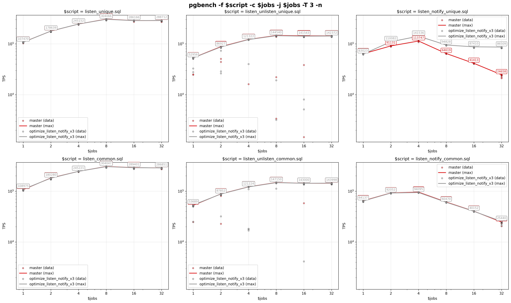

# pg-bench-listen-notify

A benchmarking tool that measures PostgreSQL LISTEN/NOTIFY performance by comparing Transactions Per Second (TPS) between standard PostgreSQL and the optimized version across different connection counts.

> **⚠️ IMPORTANT DISCLAIMER**
>
> The patches referenced in this benchmark have **not been carefully reviewed** yet by experts in PostgreSQL's async.c subsystem. While the benchmark results show promising performance characteristics, these results might be misleading if the optimization approach has unforeseen issues or doesn't work correctly in practice. The patches must undergo thorough review and testing before any conclusions are drawn about their viability.
>
> **Patches:**
> - [patch-v3: Optimize LISTEN/NOTIFY signaling for scalability](https://github.com/joelonsql/postgresql/commit/18004e66974fc9d4a93e00b0183959ac306c7218)

## Key Results

### TPS Performance Comparison


The log-log scale chart shows TPS (Transactions Per Second) performance across different connection counts:
- **X-axis**: Number of extra listening connections (0, 10, 100, 1000) - log scale
- **Y-axis**: Transactions per second - log scale  
- **Data points**: Averaged over 3 runs per connection count for stability

### pgbench Performance Results

Additional performance analysis using pgbench shows detailed comparisons across different workload patterns:




For detailed analysis of all test scenarios and complete performance data, see [performance_overview.md](performance_overview.md).

## How the Benchmark Works

The benchmark creates a controlled environment to measure LISTEN/NOTIFY performance:

1. **Setup**: Creates isolated PostgreSQL instances with `max_connections=2000`
2. **Ping-pong measurement**: Two threads exchange NOTIFY messages continuously
3. **Idle listeners**: Adds the specified number of idle LISTEN connections
4. **TPS calculation**: Measures round-trips over 10 seconds after 1-second warm-up
5. **Averaging**: Takes 3 measurements per connection count for stability

### Test Configuration

**Connection counts tested:** 0, 10, 100, 1000 extra listeners  
**Measurements per count:** 3 runs averaged together  
**Measurement duration:** 10 seconds per run  
**Warm-up period:** 1 second before each measurement

## Setup

The benchmark script expects PostgreSQL installations in specific locations in your home directory:

```bash
# Expected directory structure:
~/pg-master/bin/                    # Baseline PostgreSQL master branch
~/pg-patch-v3/bin/
```

## Quick Start

```bash
# Run full benchmark for all versions
./benchmark_all_versions.sh

# Generate plot from existing results
./plot.sh

# Run pgbench performance tests
./pgbench.sh

# Generate pgbench performance charts
./plot_pgbench.sh
```

## License

MIT License - See LICENSE file
