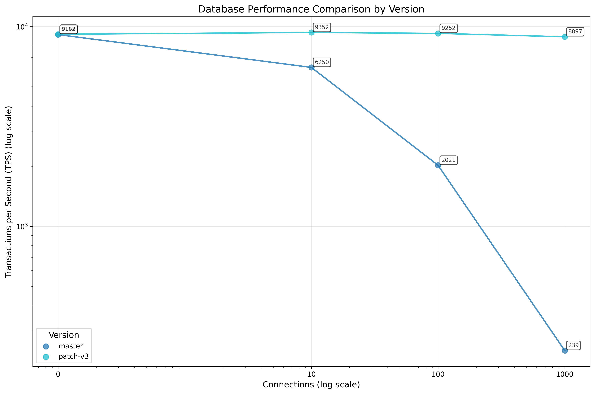

# pg-bench-listen-notify

A benchmarking tool that measures PostgreSQL LISTEN/NOTIFY performance by comparing Transactions Per Second (TPS) between standard PostgreSQL and the optimized version across different connection counts.

> **⚠️ IMPORTANT DISCLAIMER**
>
> The [`optimize_listen_notify`](https://github.com/joelonsql/postgresql/commit/aba0ffb2a9e1c5d77393a92c0ce43a968c23cbb5) patch referenced in this benchmark has **not been carefully reviewed** by experts in PostgreSQL's async.c subsystem. While the benchmark results show promising performance characteristics, these results might be misleading if the optimization approach has unforeseen issues or doesn't work correctly in practice. The patch must undergo thorough review and testing before any conclusions are drawn about its viability.

## Key Results

### TPS Performance Comparison


The log-log scale chart shows TPS (Transactions Per Second) performance across different connection counts:
- **X-axis**: Number of extra listening connections (0, 10, 100, 1000) - log scale
- **Y-axis**: Transactions per second - log scale  
- **Data points**: Averaged over 3 runs per connection count for stability

### Performance Analysis

The benchmark reveals a dramatic difference in scaling behavior:

| Connections | Master TPS | Optimized TPS | Performance Ratio |
|-------------|------------|---------------|-------------------|
| 0           | ~9,126     | ~9,152        | 1.00x            |
| 10          | ~6,233     | ~9,352        | 1.50x            |
| 100         | ~2,020     | ~9,320        | 4.62x            |
| 1,000       | ~238       | ~8,937        | 37.55x           |

**Key Observations:**
- **Standard PostgreSQL**: Shows dramatic TPS degradation as connections increase (O(N) scaling)
- **Optimized version**: Maintains consistent high TPS regardless of connection count (near-O(1) scaling)
- **Performance gap**: Grows exponentially with connection count, reaching 37x improvement at 1,000 connections

### Understanding the Results

**Standard PostgreSQL scaling issues:**
- **0 connections**: Baseline performance ~9,126 TPS
- **10 connections**: 32% TPS reduction to ~6,233 TPS  
- **100 connections**: 78% TPS reduction to ~2,020 TPS
- **1,000 connections**: 97% TPS reduction to ~238 TPS

**Optimized PostgreSQL maintains performance:**
- **Consistent TPS**: ~9,150 TPS across all connection counts
- **Minimal degradation**: Only 2.3% TPS reduction even at 1,000 connections
- **Scalable architecture**: Performance independent of idle listener count

## How the Benchmark Works

The benchmark creates a controlled environment to measure LISTEN/NOTIFY performance:

1. **Setup**: Creates isolated PostgreSQL instances with `max_connections=2000`
2. **Ping-pong measurement**: Two threads exchange NOTIFY messages continuously
3. **Idle listeners**: Adds the specified number of idle LISTEN connections
4. **TPS calculation**: Measures round-trips over 10 seconds after 1-second warm-up
5. **Averaging**: Takes 3 measurements per connection count for stability

### Test Configuration

**Connection counts tested:** 0, 10, 100, 1000 extra listeners  
**Measurements per count:** 3 runs averaged together  
**Measurement duration:** 10 seconds per run  
**Warm-up period:** 1 second before each measurement

### PostgreSQL Versions Tested

- **master**: Current PostgreSQL development branch
- **optimize_listen_notify**: Optimized version with the performance patch

## Setup

The benchmark script expects PostgreSQL installations in specific locations in your home directory:

```bash
# Expected directory structure:
~/pg-master/bin/                    # PostgreSQL master branch
~/pg-optimize_listen_notify/bin/    # PostgreSQL with optimization patch
```

## Quick Start

```bash
# Run full benchmark for all versions
./benchmark_all_versions.sh

# Generate plot from existing results
./plot.sh
```

### Requirements

- PostgreSQL installations (master and optimize_listen_notify) in your home directory:
  - `~/pg-master/bin` - PostgreSQL master branch
  - `~/pg-optimize_listen_notify/bin` - PostgreSQL with the optimization patch
- Rust 1.70+
- Python 3.7+ with pandas, matplotlib, numpy, scipy
- macOS or Linux
- 8GB+ RAM recommended

## Understanding the Chart

The log-log scale visualization clearly shows the performance characteristics:

**Chart Features:**
- **Log-log scale**: Both axes use logarithmic scaling to show the dramatic differences
- **Annotations**: Exact TPS values displayed for each data point
- **Connected lines**: Show performance trends for each version
- **Color coding**: Different colors for master vs optimized versions

**Reading the Results:**
- **Flat line**: Indicates consistent performance (optimize_listen_notify)
- **Steep decline**: Shows performance degradation (master)
- **Annotation values**: Exact averaged TPS measurements

## Output Files

- **benchmark_results.csv**: Raw TPS measurements with version information
- **plot.png**: TPS comparison chart (log-log scale)

## Technical Implementation

The benchmark uses Rust with tokio for async PostgreSQL connections:

1. **PostgreSQL Setup**: Configures isolated instances with optimal settings
2. **Ping-pong Threads**: Two threads exchange notifications to measure round-trip performance
3. **Idle Listeners**: Additional connections that LISTEN but don't participate in messaging
4. **TPS Measurement**: Counts round-trips over fixed time periods
5. **Statistical Analysis**: Averages multiple runs for stable results

### Command Line Options

```bash
cargo run --release -- [PG_BIN_PATH] [OUTPUT_FILE] [OPTIONS]

Arguments:
  PG_BIN_PATH   Path to PostgreSQL bin directory (optional)
  OUTPUT_FILE   Output CSV file (default: stats.csv)

Options:
  --version-name NAME    Use custom version name instead of querying PostgreSQL
```

## Troubleshooting

**"Too many open files"**: The benchmark automatically increases file descriptor limits, but you may need:
```bash
ulimit -n 65536
```

**PostgreSQL connection errors**: Ensure PostgreSQL versions are installed in the expected locations:
- `~/pg-master/bin` - PostgreSQL master branch
- `~/pg-optimize_listen_notify/bin` - PostgreSQL with optimization patch

**Python plotting errors**: Install dependencies:
```bash
pip install -r requirements.txt
```

## License

MIT License - See LICENSE file
